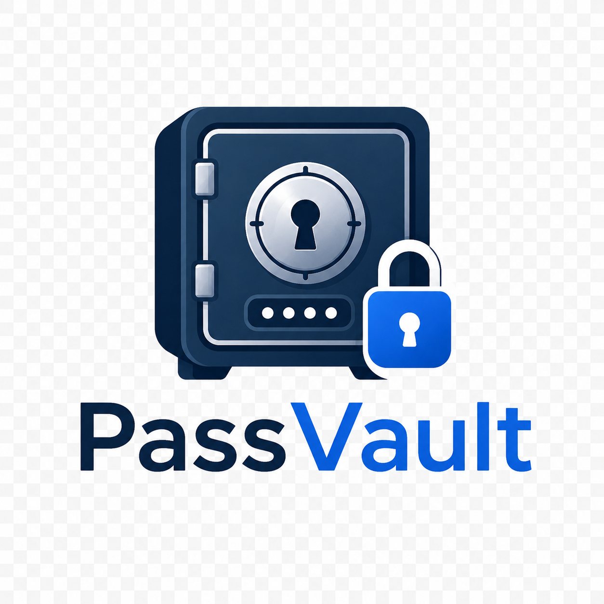

<h1 align="center">
  
  <br>PassVault
</h1>

<p align="center">
  <strong>Lightweight encrypted password manager</strong><br>
  <sub>轻量级加密密码管理器</sub>
</p>

<p align="center">
  <a href="#-english">English</a> &nbsp; | &nbsp;
  <a href="#-中文">中文</a>
</p>

<p align="center">
  
  
  
  
  
</p>

<hr>

<h2 id="-english">English</h2>

### Features

PassVault is a desktop password manager built with Electron, designed for personal use.

- **Dual Unlock** — Master password (daily) + recovery key (emergency). Either unlocks the vault
- **AES-256-GCM Encryption** — All passwords encrypted in a single `.pvault` file before touching disk
- **Multi-Vault Tagging** — Classify entries by vault (Work, Personal, etc.). One entry can belong to multiple vaults
- **Smart Search** — Filter by website, alias, account, or password field. Toggle field priority
- **Drag & Drop** — Reorder entries via long-press drag, resize columns like Excel
- **Auto-Lock** — Idle timeout locks the app back to the lock screen
- **Trash Bin** — Deleted entries go to trash, recoverable anytime
- **Password Generator** — Built-in with customizable character sets, length, prefix/suffix
- **Clipboard Auto-Clear** — Copied passwords cleared after configurable timeout
- **Import / Export** — Plain JSON or encrypted .pvault format, with conflict resolution
- **WebDAV Sync** — Sync vault to Nutstore (坚果云) or any WebDAV provider. Credentials encrypted with master password
- **Customizable** — Dark/Light theme, Chinese/English UI, keyboard shortcuts, per-column widths
- **No Framework** — Pure HTML/CSS/JS. Zero frontend dependencies

### Screenshots

> Coming soon

### Quick Start

**Requirements**: Node.js ≥ 18

```bash
# Clone
git clone https://github.com/lvivvde/PassVault.git
cd PassVault

# Install
npm install

# Run (dev mode)
npm start

# Build Windows installer
npm run build
# Output: dist/PassVault Setup 1.0.0.exe (~55 MB)
```

### Project Structure

```
passvault/
├── main.js              # Electron main process entry
├── preload.js           # IPC bridge (contextIsolation)
├── package.json
├── src/
│   ├── main/            # Main process modules
│   │   ├── crypto.js    # PBKDF2 + AES-256-GCM engine
│   │   ├── vault.js     # Data CRUD, multi-vault, trash
│   │   ├── settings.js  # JSON config manager
│   │   ├── logger.js    # Lazy-init file logging
│   │   ├── sync.js      # WebDAV sync (push/pull/auto)
│   │   ├── autoLock.js  # Idle detection timer
│   │   └── ipc-handlers.js  # 40+ IPC channels
│   ├── renderer/        # UI (SPA, 4 pages)
│   │   ├── index.html
│   │   ├── css/         # base, lock, main, settings
│   │   └── js/          # app, lock, table, main, settings, i18n
│   └── shared/
│       └── constants.js
├── icon/                # App logo (user-replaceable)
├── docs/                # DESIGN.md, CHANGELOG.md
└── dist/                # Build output
```

### Security

| Layer | Scheme |
|-------|--------|
| Recovery key → REK | PBKDF2 (100K iterations) → 32-byte key |
| Master password → KEK | PBKDF2 (600K iterations) → encrypts REK |
| Vault encryption | AES-256-GCM (file-level) |
| File write | Atomic (tmp + rename), auto-backup (.bak) |
| Memory | Decrypted data zeroed on lock |

### License

MIT — see [LICENSE](LICENSE)

---

<h2 id="-中文">中文</h2>

### 功能特性

PassVault 是一款基于 Electron 的桌面密码管理器，面向个人用户设计。

- **双入口解锁** — 主密码（日常使用）+ 恢复密钥（应急），任一即可解锁密码库
- **AES-256-GCM 加密** — 所有密码在写入磁盘前整文件加密，仅一个 `.pvault` 文件
- **多密码库标签化** — 条目按 Vault 分类（工作/个人/服务器等），一条目可归属多个 Vault
- **智能搜索** — 按网站/别称/账号/密码字段过滤，支持字段优先级切换，密码字段互斥
- **拖拽排序** — 长按 ≡ 手柄拖拽排序，列宽可自定义拖拽（类似 Excel），本地缓存
- **自动锁屏** — 空闲超时自动回到锁屏界面，防止他人偷窥
- **回收站** — 删除的条目进回收站，可随时恢复或永久清空
- **密码生成器** — 内置，支持字符类型/长度/前后缀/排除相似字符等高级选项
- **剪贴板自动清除** — 复制密码后按设定时间自动清除
- **导入导出** — 支持明文 JSON 和加密 .pvault 格式，导入冲突逐条弹窗确认
- **WebDAV 云同步** — 支持坚果云等 WebDAV 服务，凭证用主密码加密存储
- **高度可定制** — 深色/浅色主题，中/英文界面，快捷键绑定，列宽记忆
- **零前端框架** — 纯 HTML/CSS/JS，无任何第三方 UI 依赖

### 界面预览

> 即将添加

### 快速开始

**环境要求**：Node.js ≥ 18

```bash
# 克隆仓库
git clone https://github.com/lvivvde/PassVault.git
cd PassVault

# 安装依赖
npm install

# 开发模式运行
npm start

# 打包 Windows 安装程序
npm run build
# 输出: dist/PassVault Setup 1.0.0.exe (~55 MB)
```

### 项目结构

```
passvault/
├── main.js              # Electron 主进程入口
├── preload.js           # IPC 桥接（contextIsolation 隔离）
├── package.json
├── src/
│   ├── main/            # 主进程模块
│   │   ├── crypto.js    # PBKDF2 + AES-256-GCM 加密引擎
│   │   ├── vault.js     # 数据增删改查、多 Vault、回收站
│   │   ├── settings.js  # JSON 配置文件管理
│   │   ├── autoLock.js  # 空闲检测定时器
│   │   └── ipc-handlers.js  # 30 条 IPC 通信通道
│   ├── renderer/        # 渲染层（单页应用，4 个页面）
│   │   ├── index.html
│   │   ├── css/         # base, lock, main, settings
│   │   └── js/          # app, lock, table, main, settings, i18n
│   └── shared/
│       └── constants.js
├── icon/                # 应用图标（用户可替换）
├── docs/                # 设计文档、变更日志
└── dist/                # 构建输出
```

### 安全架构

| 层级 | 方案 |
|------|------|
| 恢复密钥 → REK | PBKDF2（10万轮迭代）→ 32字节密钥 |
| 主密码 → KEK | PBKDF2（60万轮迭代）→ 加密 REK |
| 密码库加密 | AES-256-GCM（整文件加密） |
| 文件写入 | 原子写入（临时文件 + rename），自动备份（.bak） |
| 内存安全 | 锁屏时擦除解密数据 |

### 开源协议

MIT — 详见 [LICENSE](LICENSE)
